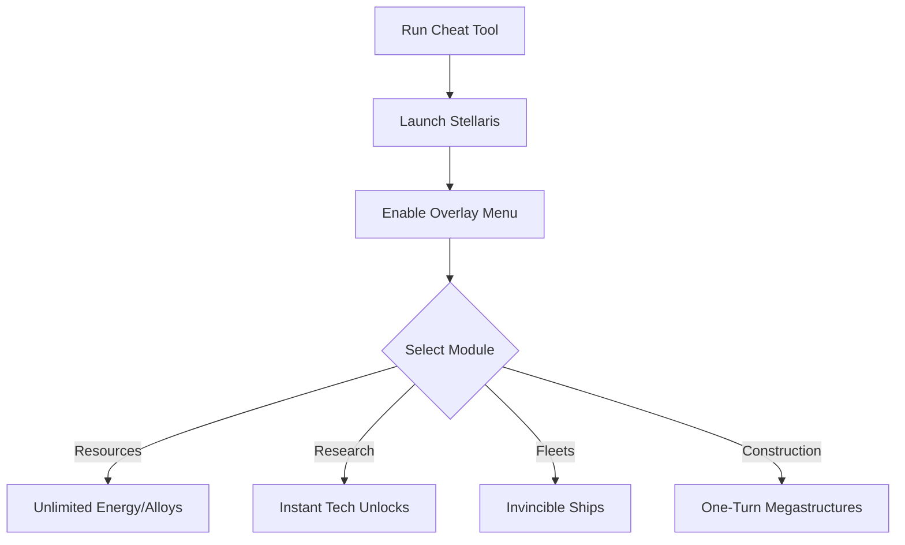

# Stellaris Cheat 🌌

The **Stellaris Cheat Software** gives players full control over their empire and fleets with a clean overlay menu and customizable configs. Whether you want to **speed up research, boost resources, or create invincible ships**, this trainer makes galaxy building faster, smoother, and more creative.

[](#)
[](#)
[](#)
[](#)

---

## 📝 Overview

Stellaris offers deep empire management, but tech trees and fleet production can take hours. This cheat software lets you **skip grind and focus on strategy**, with features like **unlimited energy, instant research, and one-turn fleet construction**—perfect for sandbox runs and campaign experiments.

\[!IMPORTANT]
The cheat works in memory only and does not permanently change game files or saves.

---

## ⭐ Features

* **Unlimited Resources** – Energy, minerals, alloys, and influence at max.
* **Instant Research** – Unlock technologies without waiting.
* **God Mode Fleets** – Invincible ships for large-scale testing.
* **One-Turn Construction** – Build ships, megastructures, and stations instantly.
* **Empire Edits** – Adjust ethics, traditions, or unity points.
* **Overlay Menu** – Manage all features live in-game.

---

## 🖥 Compatibility

| Platform         | Supported | Notes              |
| ---------------- | --------- | ------------------ |
| Windows 10/11    | ✅         | Full support       |
| Steam            | ✅         | Stable integration |
| Paradox Launcher | ✅         | Compatible         |
| Linux (Proton)   | ⚠️        | Limited support    |
| Consoles         | ❌         | Not supported      |

\[!NOTE]
Accessibility: Overlay offers scalable text, high-contrast mode, and keyboard/controller navigation.

---

## ⚡ Setup Guide

1. **Download** the Stellaris Cheat package.
2. Extract into your Stellaris root directory.
3. Run `Stellaris_Cheat.exe` as administrator.
4. Launch the game and press `F1` to open the overlay menu.
5. Configure features via the panel or `config.ini`.

```ini
[cheat]
resources=unlimited
research=instant
fleet_godmode=true
construction=one_turn
unity=999999
```

---

## 🔄 Cheat Workflow



---

## ❓ FAQ

**Q: Can this be used in multiplayer?**
A: No, it is intended for **single-player only**.

**Q: Does it affect story progression?**
A: No, narrative events remain unchanged.

**Q: Can I toggle features mid-game?**
A: Yes, hotkeys and overlays allow instant control.

**Q: Will this overwrite my saves?**
A: No, unless you save with cheats enabled.

**Q: Can I create multiple empire profiles?**
A: Yes, configs support different presets for various playstyles.

---

## 🚀 Final Thoughts

The **Stellaris Cheat Software** unlocks new freedom with **instant research, invincible fleets, and unlimited resources**. Whether you’re testing strategies or building your dream empire, this tool puts the galaxy at your command.

---
